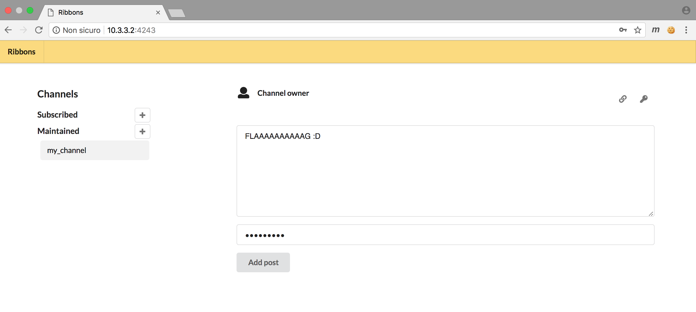
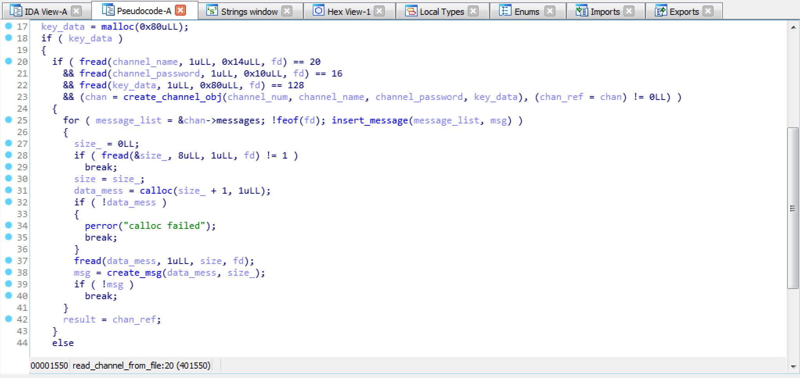
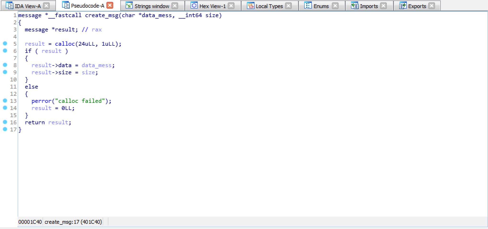
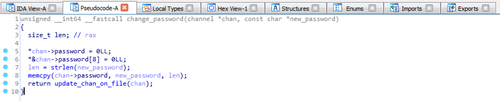
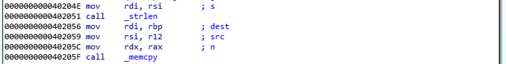
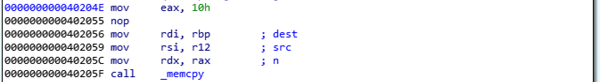
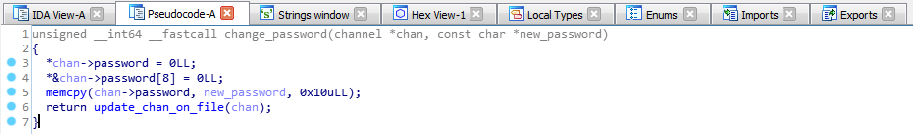

# Ribbons

## Interaction and Reversing
We were given a **data** folder, a **static** folder and an ELF 64-bit executable, called **ribbons**.  
I immediately started by having a glance at how the site looked like and I tried to interact a bit!

#### Interaction
It seems like it's possible to create a channel, write messages in it and use an invitation to view someone else's channel.  
Inside the file [static/index.js](./chall/static/index.js) we find what requests can be made to the service.  
Here's a brief description of the the requests I was particularly interested in:
* ```add_channel(name, password)``` adds a channel and returns an Id which identifies the channel.
* ```add_post(channel_id, password, text)``` adds a message to the channel you created.
* ```get_key(channel_id, password)``` gives you the key associated with your channel (the key is used to decrypt posts in the channel).
* ```change_password(channel_id, password, new_password)``` allows you to change your channel's password.
* ```view(channel_id)``` retrieves a channel and its posts.

I didn't know whether the flag would have been stored in the password field or in the posts...  
Very soon I discover the bot adds a channel and stores the flag in a post.
Our goal seems to read the messages in the bot's channels without an invitation!

#### Structs
Let's open IDA Pro and reverse some stuff!  
There are a bunch of functions that handle requests, responses and daemons, but I want to focus on what a channel is.  
By searching for functions that interacts with the files stored in **data** I realize that channels are represented in memory using a structure as follow:  
```c
struct channel{
	int chan_id;
	char name[20];
	char password[16];
	char * key;
	messages * messages;
};
```
Files are written and read in binary: their name is the Channel Id and they contain the name of the channel, its password, key and encrypted messages. 
Keys are 128 Bytes long. 



Although it's not relevant to the exploit, here's the structure of the posts and how they are loaded in memory.
```c
struct messages{
	char * data;
	__int64 size;
	message * next;
};
```


#### Vulnerability
It's time to find a bug!  

I started searching for functions related to the requests.  
Inside the bss section we can find pointers to functions that are used to accomplish what the requests ask for.
After reversing most of them, there seems to be an overflow in the ```change_password()``` method.  
In fact, once the check over the old password is completed, a ```memcpy()``` of size ```strlen()``` of the new password is performed on the ```channel->password``` field.  
It seems like it's possible to overwrite some bytes of the key address!



## Patch
I suddenly tought that the obvious way to patch the binary was to fix the ```memcpy()``` size to 0x10.  
That way attackers couldn't overwrite any byte other than the password's ones.  

So I had a look at the function's disassembly


and I changed the assembly that way, being careful not to mess up with instruction's sizes:



That's how the patch looks like in pseudocode.



## Exploitation
Since it's possible to create a channel and ask back for its key... and since channels are stored in the heap...  
It's possible to dump a great piece of heap 128 Bytes at a time!

#### Wow, there's a Leak!
We can create a channel and change our own channel's password to overwrite the ```key``` pointer.  
This way, changing only the last bytes, we have valid a pointer to the heap.  
In order to leak memory, we can:
* Create a new channel.
* Change password and overflow into the pointer.
* Ask for our channel's key, reading 128B from the heap.  
* Change password again and leak other chunks of memory.

### But, what can we do with our leak?
At the beginning we had several ideas, but...  
There are a few problems that should be taken into consideration:
* ```strlen()``` stops when **\0** is found, that means no 0s in the "password payload". 
* We have to read the memory carefully, 128B at a time.
* Channels are stored on files, sometimes they are freed on the heap: when they are freed we lose both their key and id (id gets overwritten by heap pointers, key and messagess are freed).
* What should we search for?
* Retrieving a key without a Channel id means we need to bruteforce ids and try to decrypt messages and find valid flags.
* How do we recognize data?

#### The final idea
After a (not so short) while I realized what I wanted to do and what I was searching for.  
The idea was to:
* Search for "in use" channels.
* Find Id and password of each one.
* Ask for their key.
* Ask for their posts.
* Decrypt them by using the algorithm that can be found [here](./chall/static/index.js) or in the binary.

#### Overcoming problems
To overcome those problems I mentioned above I've found the following solutions:  

* To defeat ```strlen()``` it is possible to read the heap in steps of 128, aligning memory to the 8th Byte thus avoiding writing 0s.

* Channel ids are incremental: if I want to be sure there will be new channels (we want new flags!) in memory when I search for them, I can ask with ```view``` the last X channels from ```My_channel_id - 1``` to ```My_channel_id - X```.


* Since I want to search for channels, I need to recognize them.
The size of an allocated channel is **0xb5**:  
I can search inside those 128B of leak, other mini-chunks of 8 Bytes that are equal to 0xb5.  

That way I know when I'm watching a channel structure and I can find ids and passwords!


#### Implementation
You can find my exploit here [exploit.py](./exploit.py).  
It could certainly be improved, but it worked and that's how I wrote it during the competition (and the flight). I wanted to keep it like that, so I just rearranged the code a bit and added some comments :)  

I suggest you running [bot.py](./bot.py) to create some channels, then I would restart the service and run the exploit.  
The way I read the memory in this exploit is such that once you run the exploit you get the flags and the other time you do it you make the service *segfaults*, causing a kind of a *DoS* (even though Docker mitigates it).

## Extras
I came across this challenge while playing RuCTF Finals 2018 with Tower of Hanoi team in Ekaterinburg. I really enjoied the CTF and this challenge in particular!  
I had a look at this service with my friend, and teammate, *marcof* who helped me a lot brainstorming for the exploit and figuring out how to interact with the service.  
 
  
This challenge has been a good Reverse Engineering exercice :P  
However, the process I went through while reversing it was not as linear as the one I tried to describe above.  
Unfortunately we had problems with tools and routers during the game so we didn't manage to write the exploit during the competition...  
Also, we were too tired and had stupid problems while scripting the solution.  

Just about 30 min before the game ended we were able to see other channels' passwords, but it was too late to finish the attack.  
I finished the exploit duringh the flight on my way back, just for fun.  
In any way I was happy I realized very soon how the challenge worked and patched the binary before Bushwhackers began to attack! (Damn, I forgot to build the container and we lost 2 flags... lol)  
Hope you enjoyed the write-up!

Kudos to the Bushwhackers who did a real good job on that challenge during the competition! :)
