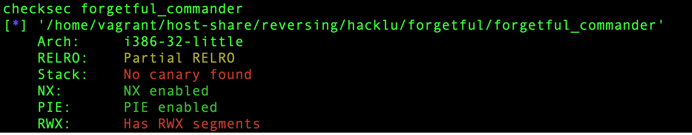
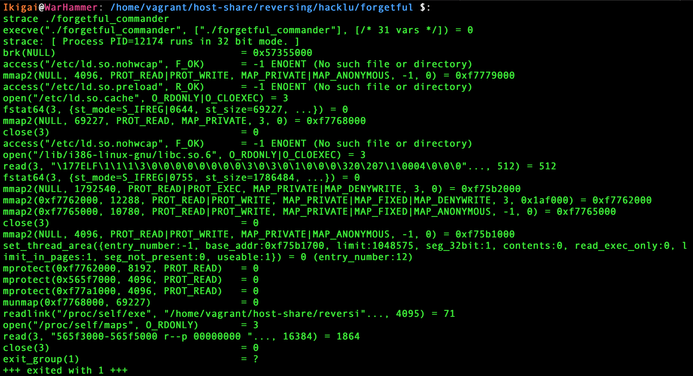
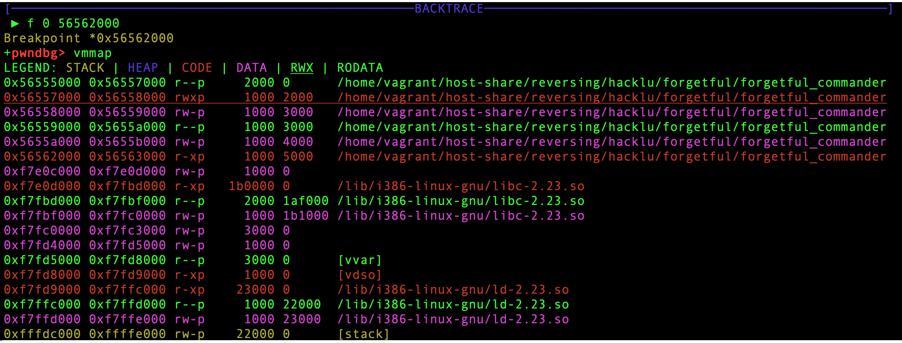
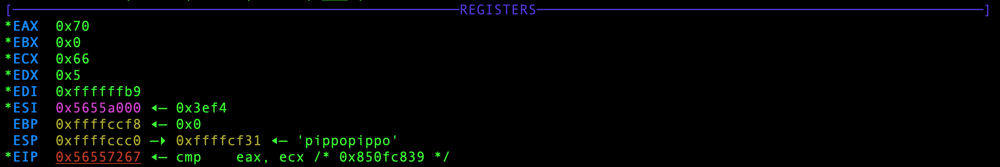

# Forgetful Commander
And you lost a key again. This time it's the key to your missiles command station.  
However, the command station got a silent password override. Even though your memory isn't that good, you don't remember the password either, your technical skills are!  
You've already dumped the binary, which checks the password. Now you just have to reverse it!  
[Forgetful Commander](forgetful_commander)


## Reversing
### At a First Glance
The first thing I usually do when I start reversing a binary is... Well... Just running it!  
Sadly, running the program does not give out any clue on its behaviour: it terminates with exit code 1, no outputs.  
Let's start digging into the binary by running a checksec to see what we are dealing with.  

It seems like the binary is a 32-bit ELF, is `PIE` and has `RWX` segments.  
Wait a sec... `RWX` segments?


Let's run `strace` to see if we can see anything more meaningful.  
Here's the result.  


Ok... weird enough.  
It's having a look at what's inside `/proc/self/maps` and it's retrieving the absolute path to the binary.


Although I had a look at the binary with IDA to better understand what was going on, I mostly used gdb to solve this challenge.  
I wanted to perform a dynamic program analysis rather than a static one.  
I'll skip the parts where I swam through the `jmp`s and the weird things this binary does and focus on the core points of the analysis.

### Unpacking
Loading the binary in gdb and running `start` and `vmmap` reveals the following sections:
  

Running the binary till `0x565621cf` reveals that the code is returning, and continuing, at `0x56557050`: an address in the `RWX` zone.  
The binary is now unpacked and ready to run.  
To analyze it better I decide to produce a gdb core dump and load it into IDA.  
`gcore dumpp` will produce a dump called `dumpp` containing the binary unpacked.

### Debugging and anti-debugging

Until this moment no input has been read. If we let the program continue it terminates without requiring any input: my bet is that our chance to change the behaviour of the program is via the args.  

I run the program with `argv[1]="pippopippo"` and set a read watchpoint (`rwatch address`) on the argument to see whether is ever read or not.  
The watchpoint stops the execution inside the libc and at the instruction `0x56557219` where the letter 'p' is loaded in `ecx`. Bingo, isn't it?  
Having a look in IDA reveals the following:
```asm
load:56557210 8B 45 0C                       mov     eax, [ebp+0Ch]
load:56557213 8B 40 04                       mov     eax, ds:(off_5655A004 - 5655A000h)[eax]
load:56557216 8B 4D E0                       mov     ecx, [ebp-20h]
load:56557219 8A 14 08                       mov     dl, ds:(byte_5655A000 - 5655A000h)[eax+ecx]
load:5655721C 88 55 DF                       mov     [ebp-21h], dl
load:5655721F 8B 45 E8                       mov     eax, [ebp-18h]
load:56557222 9C                             pushf
load:56557223 5A                             pop     edx
load:56557224 89 D1                          mov     ecx, edx
load:56557226 81 E1 00 01 00+                and     ecx, 100h
load:5655722C 31 CA                          xor     edx, ecx
load:5655722E C1 C9 02                       ror     ecx, 2
load:56557231 31 CA                          xor     edx, ecx
load:56557233 52                             push    edx
load:56557234 89 C2                          mov     edx, eax
load:56557236 9D                             popf
load:56557237 0F 44 D1                       cmovz   edx, ecx
load:5655723A 89 D0                          mov     eax, edx
load:5655723C 89 45 E8                       mov     [ebp-18h], eax
load:5655723F 0F BE 45 DF                    movsx   eax, byte ptr [ebp-21h]
load:56557243 8B 4D E0                       mov     ecx, [ebp-20h]
load:56557246 8B 75 D8                       mov     esi, [ebp-28h]
load:56557249 0F BE 8C 0E F1+                movsx   ecx, byte ptr [esi+ecx-1C0Fh]
load:56557251 8B 7D E8                       mov     edi, [ebp-18h]
load:56557254 8B 5D E0                       mov     ebx, [ebp-20h]
load:56557257 0F AF 5D E4                    imul    ebx, [ebp-1Ch]
load:5655725B 01 DF                          add     edi, ebx
load:5655725D 0F BE BC 3E 08+                movsx   edi, byte ptr [esi+edi-1FF8h]
load:56557265 31 F9                          xor     ecx, edi
load:56557267 39 C8                          cmp     eax, ecx
load:56557269 0F 85 09 00 00+                jnz     loc_56557278
```

But wait, there is some sort of anti-debugging stuff in here!  
The piece of code between the `pushf` and the `popf` essencially checks whether you are stepping through the code one instruction at a time by checking if the `0x100 TRAP flag` is set.  
If you want to know more on what the [trap flag](https://en.wikipedia.org/wiki/Trap_flag) is here's a brief explaination.  
If you are executing in single-step mode, the conditional move `cmovz` will be done and the content of `edx` would be overwritten by `ecx`, changing the value stored in `[ebp-18h]` and the value of `ecx` in the `cmp` instruction.  
A simple way to avoid this anti-debugging technique is executing `set $edx=$eax` after the conditional move is executed. Another simple way, which I like best, is to place a breakpoint on the compare instruction (`hbreak *0x56557267`) and continue the execution without stepping instruction after instruction \0/.  
If you manage to fool the anti-debugging trick here's how the registers look like at the very moment of the `cmp` instruction.
  

WOW! `ecx` is 0x66, it's the f of flag!

## Scripting
The program cycles over the argument comparing each byte of the input with the corresponding one of the flag, in plaintext.  
We can dump all the chars of the flag writing a gdbinit like the following one:
```
#load the file to be debugged
file forgetful_commander

#set a breakpoint at the beginning of the .text
b *0x56562000

#start the program with a bunch of A as argv[1]
start AAAAAAAAAAAAAAAAAAAAAAAAAAAAAAAAAAAAAAAAAAAAAAAAAAAAAAAAAAAAAAAAAAAAAA

#set a hardware breakpoint at the cmp instruction
hbreak *0x56557267

#define a list of commands to be executed when the second breakpoint is triggered
commands 2
	silent					#no gdb output
	printf "%c", $ecx 		#print the content of ecx as a character
	c 						#continue
end

#continue the execution after the first breakpoint
c
```
Running `gdb -x gdbinit` will print the whole flag and some rubbish... :P

Turns out that the flag was:  
`flag{Just_type__Please__and_the_missles_will_be_launched.}`
